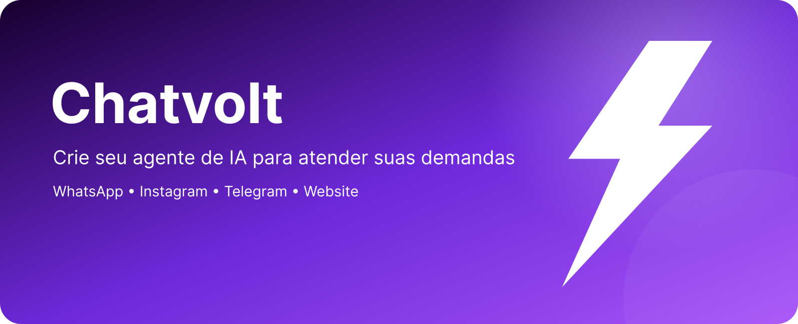
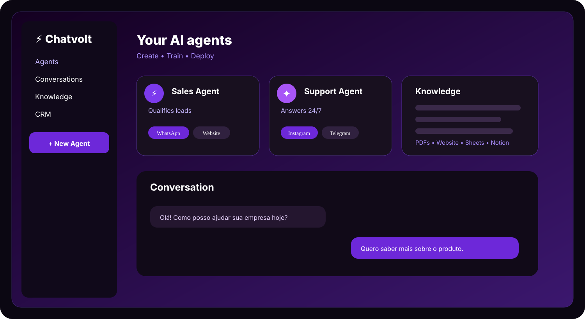
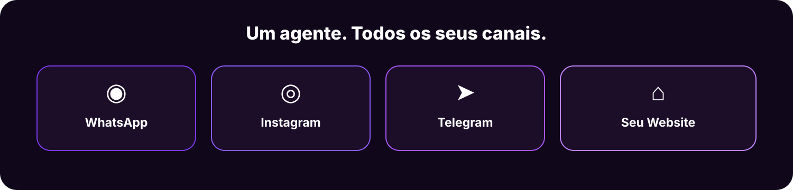

 

# ⚡ Chatvolt

### Agentes de IA para atendimento e vendas

**Automatize conversas. Conquiste clientes. Escale seu negócio.**

&nbsp;

## ⚡ A inteligência que trabalha pelo seu negócio

A **Chatvolt** é uma plataforma de agentes de IA no-code para **atendimento, vendas e CRM**.

Crie um agente que conhece o seu negócio, converse com seus clientes em diferentes canais e deixe sua equipe assumir quando uma conversa precisar de atenção humana. A plataforma foi projetada para colocar um agente no ar rapidamente, sem programação.

---

## 💬 Um agente. Todos os seus canais.

O mesmo agente, o mesmo histórico e a mesma base de conhecimento onde seu cliente estiver falando com você.

**WhatsApp · Instagram · Telegram · Website**

---

## 🧠 A IA conhece o seu negócio

Treine seus agentes com os dados que já fazem parte da sua operação:

| 📄 Documentos | 📊 Dados | 🌐 Conteúdo |
|---|---|---|
| PDFs | Planilhas | Website |
| Manuais | JSON / CSV | Notion |
| Políticas | Catálogos | Google Drive |

A Chatvolt também oferece catálogo digital para que o agente consulte produtos, preços, descrições e mídias durante a conversa.

---

## 🤝 IA + humanos

Automação não significa perder o toque humano.

Quando a conversa exige uma pessoa, a Chatvolt permite que sua equipe assuma o atendimento preservando o contexto e o histórico.

> **Automatize o repetitivo.  
> Conecte pessoas quando elas fazem a diferença.**

---

## 📈 Feita para atender e vender

Seus agentes podem:

- 🎯 Qualificar leads
- 💬 Responder clientes 24/7
- 🛍️ Recomendar produtos e serviços
- 📋 Coletar informações
- 🔄 Fazer follow-ups
- 🤝 Encaminhar conversas para a equipe
- 📊 Trabalhar junto ao CRM
- ⚡ Atuar em diferentes canais

A Chatvolt apresenta atualmente recursos de CRM nativo (Flux), monitoramento de conversas, base de conhecimento e integrações com canais e serviços externos.

---

## ⚡ Como funciona

**01 — Crie**

Crie seu agente em um painel visual, sem programar.

**02 — Ensine**

Adicione o conhecimento do seu negócio.

**03 — Conecte**

Escolha os canais onde seus clientes irão conversar com a IA.

**04 — Escale**

Deixe o agente cuidar das conversas e concentre sua equipe no que precisa de intervenção humana.

A própria Chatvolt apresenta o fluxo de criação, treinamento e conexão como um processo de poucos passos, com publicação rápida.

---

# 🚀 Pronto para colocar sua IA para trabalhar?

### Transforme conversas em oportunidades com a Chatvolt.

 

  

**Sem programação · Atendimento 24/7 · Comece em minutos**

🌐 [Website](https://chatvolt.ai) · 📚 [Documentação](https://docs.chatvolt.ai) · ⚡ [Começar grátis](https://chatvolt.ai)

  

© 2026 Chatvolt AI. All rights reserved.

